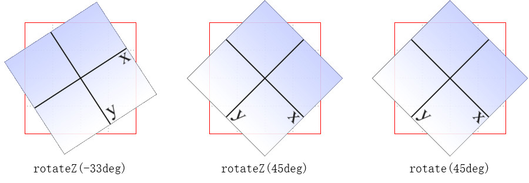

#### 变形

* `scalex()`，缩放，在x轴上进行缩放。

* `scaley()`，缩放，在y轴上进行缩放。

  scalex和scaley的值只能是无单位的实数始始终为正数（可以用小数），值的意思是宽度或高度的倍数。

  经过变形的元素可能比变形之前大也可能比变形之前小。不管是大还是小在页面上所占空间与变形前保持不变。

* `scale(x,y)`，在x轴和y轴上同时进行缩放。

  如果只在scale上使用一个值时将该值同时应用在x轴和y轴上。

* `skewx()`，元素在水平方向扭曲变形。如果只为正数，元素的左上角和右下角将会被拉扯。如果值为负数，元素的右上角和左下角会被拉扯。

  

* `skewy()`，元素在垂直方向扭曲变形。如果只为正数，元素的左上角和右下角会被拉扯。如果值为负数，元素的右上角和左下角将会被拉扯。

  

  倾斜之后他的坐标系会发生改变。

* `rotatez()`，`rotate()`，沿着z轴旋转指定的角度。

  

  旋转角度会更改x和y坐标。

  translatex正值右，负值左。

* 移动原点

  默认的时候变形都以元素的绝对中心作为变形的原点（如：旋转），`transform-origin`可以更改原点的位置。

  最常用、主要就是旋转的影响。

  `transform-origin:value`

  value的值可以分为两个：第一个值针对横向，第二个值针对纵向。


#### 动画

过渡是在状态发生变化时候把属性从一个规则中设定的值变成另外一个规则中设定的值，这个变化是在一段时间内完成的，而不是瞬间完成的。

CSS的动画与过渡相同点就是CSS属性的值都在一段时间内发生变化，不同点就是动画对变化的方式有更大的控制权（比如如何重复，能够深度控制整个动画的过程）。从某种程度上来讲过渡只是一种简单的动画。

定义步骤：

1. 定义关键帧
2. 在元素上使用动画
3. 指定动画的持续时间

#### 简单实现

* 定义关键帧

  想要为元素添加动画效果，就要有一个规则，规则需要有一个名字。这个规则的名字可以重复使用。

  格式： 

  ```css
  @keyframes 规则名{
  }
  ```

  在规则中会有一个到多个的关键帧的块，每个关键帧块都包括关键帧选择符（动画持续时间内的时间点）和属性、值。多个关键帧块组成了一个动画效果的完整过程。

  ```css
  @keyframes test{
  	0%{
      	属性1:值1;
          属性2:值2;
      }
      100%{
      	属性1:值1;
          属性2:值2;
      }
  }
  ```

  上面的0%关键帧选择符表示在动画开始时希望某个元素的属性值是什么。

  * 0%、100%表示动画播放到0%和100%时候分别希望元素的值是什么。
  * 75%，动画进行到75%的时候的值。也可以使用其他的百分值。

* 在元素上使用动画

  `animation-name:value`

  * none，没有规则名。
  * 规则名称，定义时的规则名。

* 动画的持续时间

  如果说只有规则没有时间，那开始就是结束，马上到结束状态。

  `animation-duration:value`

  指定持续的时间，单位是s或ms

  ```html
  <!DOCTYPE html>
  <html>
  
  <head>
      <style>
          div{
              width:200px;
              height:200px;
              border:1px solid green;
  
              animation-name:test;
              animation-duration: 5s;
  
          }
          @keyframes test{
              50%{
                  width:300px;
                  height:400px;
              }
              100%{
                  width:500px;
                  height:500px;
              }
          }
      </style>
  </head>
  
  <body>
      <div></div>
  </body>
  
  </html>
  ```

  1. 可以使用关键字from和to，这两个分别代表0%和100%。
  2. 超过100%，其他的关键字都是无效的。
  3. 如果说没有指定0%、100%，浏览器将使用要应用动画效果的属性的原始值自动构建一个0%和100%。
  4. 关键帧的百分比值不必按照升序进行排列。但是强烈建议你按照升序排列。
  5. `25%,75%`，表示动画进行25%或75%时候的值。
  6. 动画里面的不支持动画的属性，会直接忽略。不能识别的也忽略。


#### 多动画

格式： `animation-name:value`

* 规则1,规则2....可以定义多个规则名

  如果使用了多个规则名，可以分别为各个动画设定持续时间，值之间以逗号分隔，一般来说animation-name有多少个值，`animation-duration`就要有多少个值。

  * 如果指定的规则名不存在，不会导致所有动画都无法使用，只是不存在的动画将会被忽略。


#### 延迟播放动画

`animation-delay`来设置延迟，它用来设置等待多久之后进行第一次动画。


在多次执行动画的时候，如果要每次都有延迟可以使用动画的相关JS事件来实现。


#### 动画的迭代次数

默认声明animation-name属性动画将只播放一次。

`animation-iteration-count:value`

* 1，默认值。
* 任何数字（不能设置为负值）
* infinite，无穷大。


#### 动画的播放方向

animation-direction用来设置按照什么方向播放动画的关键帧。4个值。

* normal，默认值，每次都从0~100
* reverse，逆序播放。从100%~0%。
* alternate，动画在奇数次（1、3、5、7...）正向播放，在偶数次反向播放。
* alternate-reverse，偶数正向播放、奇数反向播放。


#### 改变动画的内部时序

`animation-timing-function`

* ease，慢速开始，然后加速，然后慢下来。
* linear，线性。

__注意： __

animation-timing-function定义的是CSS动画在每一关键帧中执行的节奏。

```html
<!DOCTYPE html>
<html>

<head>
    <style>
        div {
            margin-left: 100px;
            width: 50px;
            height: 50px;
            /* border:1px solid green; */
            border-radius: 50%;
            background-image: radial-gradient(50px at 16px 16px, red, black);

            animation-name: t;
            animation-duration: 1s;
            animation-iteration-count: infinite;
            animation-direction: alternate-reverse;
            animation-timing-function: ease;
        }

        @keyframes t {
            from {
                transform: translatey(0);
            }

            50%{
                transform: translatey(300px);
            }

            to {
                transform: translatey(500px);
            }
        }
    </style>
</head>

<body>
    <div id="t"></div>
</body>

</html>
```

